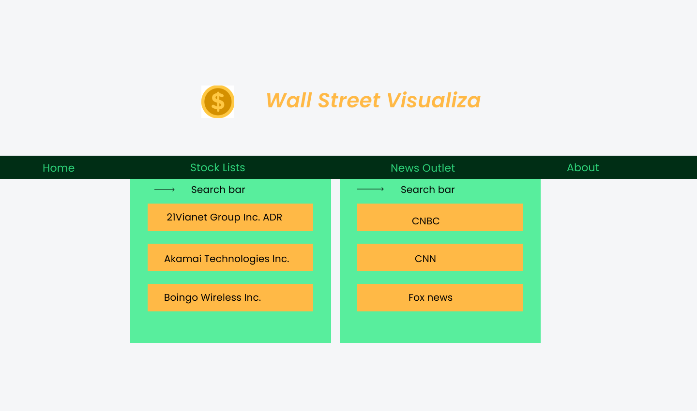
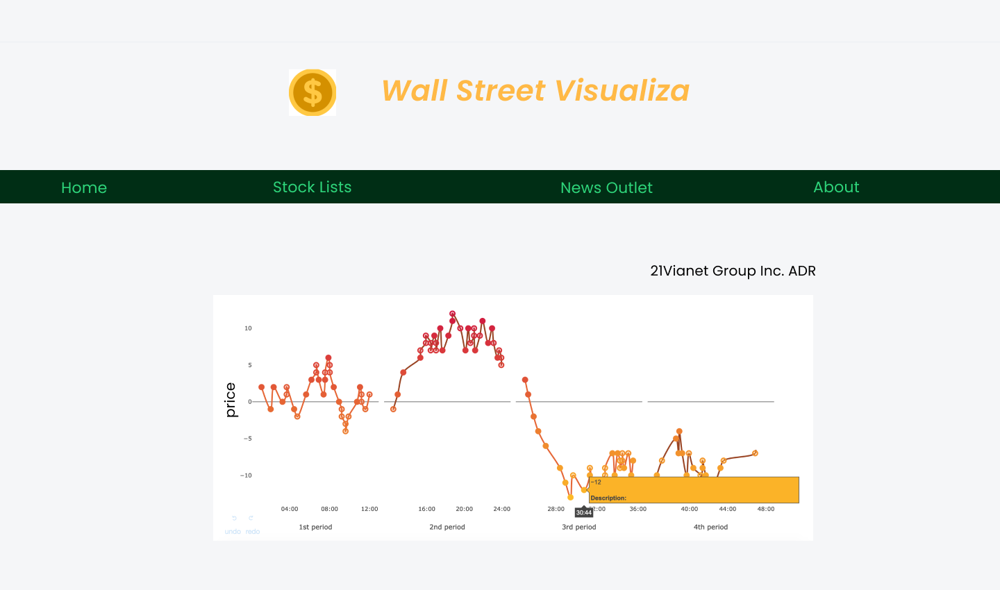

# Wall Street Visualiza

- [Wall Street Visualiza](#wall-street-visualiza)
  - [Group Members](#group-members)
  - [Project Description](#project-description)
    - [Who is it for?](#who-is-it-for)
    - [What will it do?](#what-will-it-do)
    - [What type of data will it store?](#what-type-of-data-will-it-store)
    - [What will users be able to do with this data?](#what-will-users-be-able-to-do-with-this-data)
    - [What is some additional functionality you can add or remove based on time constraints?](#what-is-some-additional-functionality-you-can-add-or-remove-based-on-time-constraints)
  - [Project Task Requirements](#project-task-requirements)
    - [Minimal Requirement](#minimal-requirement)
    - [Standard Requirements](#standard-requirements)
    - [Stretch Requirements](#stretch-requirements)
  - [Minimum Requirement Task BreakDown](#minimum-requirement-task-breakdown)
    - [Requirement 1: Category Box for a Given Company](#requirement-1-category-box-for-a-given-company)
    - [Requirement 2: Graphical representation of the price movement using charts](#requirement-2-graphical-representation-of-the-price-movement-using-charts)
  - [UI Design](#ui-design)

## Group Members

- Kyo Tang
- Eric Xiao
- Kaitian Xie

## Project Description

### Who is it for?

The project we are aiming to build is a visualization tool for users who are interested in understanding the price movements of a given publicly traded company.

### What will it do?

We will be presenting a graphical representation of price movement of a given publicly traded company. Specifically, it will be a time-series graph where the horizontal axis will be labeled with time and vertical axis will be labelled with price.

In addition, we intend to attach quarterly financial statements on days when they are released and specific color node will be used to reflect such important information release. This will allow users to easy access to such information.

### What type of data will it store?

The data stored in the project is of many forms. Specifically, data for the price movement of a particular company are of numerical value or strings. Data for the financial statements are links to the quarterly financial report.

### What will users be able to do with this data?

Users can compile all the data to perform fundamental analysis of a given publicly traded company.

### What is some additional functionality you can add or remove based on time constraints?

We are hoping to add news links to days where important news are released for a given publicly traded company.  And category the release based on the source it came from so that users can analyze the tone that a particular news outlet is projecting for this company.

## Project Task Requirements

### Minimal Requirement

- A category box that when selected will lead to the web-page of a given company.
- Graphical representation of the price movement using charts.
- Highlighted nodes of days when the reports are released.

### Standard Requirements

- A search box that allow users to search for the company that the user is interested in.
- A category box for a given company to show all available financial statements.
- A category box for a given company that categorize all the news from one news outlet.

### Stretch Requirements

- Ensuring the the tool can accommodate users to browse through at least 10 companies.
- Ensuring that all important news are featured for one particular company.

## Minimum Requirement Task BreakDown

### Requirement 1: Category Box for a Given Company

1. Creating the index.html that acts as the main page that holds all the subpage together.
1. Creating all the sub-pages for the relevant companies we intend to provide information on.
1. Creating all the sub-pages for the relevant companies we intend to provide information on.

### Requirement 2: Graphical representation of the price movement using charts

1. Finding the relevant API that can allow us to retrieve all the financial price data for the companies that we intend to show.
1. Finding relevant technologies that we can use to incorporate the financial data to form it in a graphical way so that visualization can be achieved.

## UI Design

